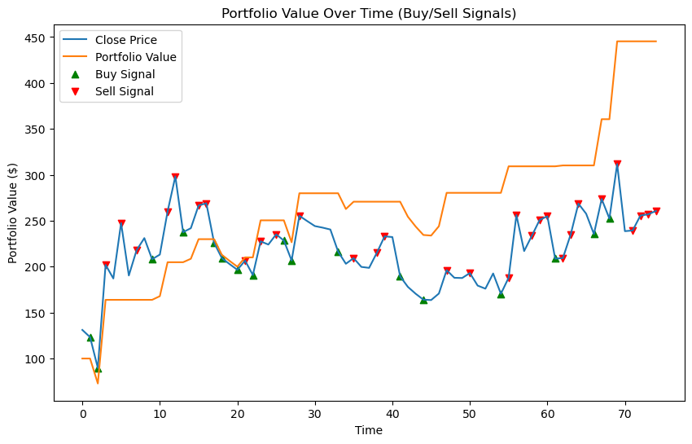

# BANKNIFTY Analysis Setup Guide

This guide will walk you through the steps to set up the environment and run the necessary Python scripts for analyzing BANKNIFTY data.\
\
All the commands have been executed and the results are already present and can be readily viewed. The commands are given to replicate the same results.

## Prerequisites

Ensure you have Anaconda installed on your system.

## 1. Create a Virtual Environment

Create a new virtual environment using Anaconda with the following command:

```bash
conda create -n banknifty_analysis python=3.10
conda activate banknifty_analysis
```

## 2. Install Required Libraries

Install the necessary libraries using pip:

```bash
pip install mplfinance pandas numpy matplotlib
```

## 3. Running the Scripts

### Step 1: Run `extract.py`

The raw data is in `.parquet.gz` format. To convert the raw data into CSV files containing 1-minute data, run the following command:

```bash
python Alaka Data/extract.py
```

After running this script, you will obtain the following 1-minute CSV files:

```
CSVs_1_min/
├── 46900PE.csv
├── 47100CE.csv
├── 47200CE.csv
├── 47400CE.csv
├── 47400PE.csv
├── 47600CE.csv
├── 47800PE.csv
```

### Step 2: Run `python_extracted_5_min_candles.py`

Next, convert the 1-minute data to 5-minute data by running:

```bash
python CSVs_1_min/python_extracted_5_min_candles.py
```

After this, the following 5-minute CSV files will be generated:

```
CSVs_5_min/
├── 5min_46900PE.csv
├── 5min_47100CE.csv
├── 5min_47200CE.csv
├── 5min_47400CE.csv
├── 5min_47400PE.csv
├── 5min_47600CE.csv
├── 5min_47800PE.csv
```

### Step 3: Run `fibonacci_retractment_image_generator.py`

Next, generate Fibonacci retracement level images by running:

```bash
python CSVs_5_min/fibonacci_retractment_image_generator.py
```

This will create the following images in the `Fibonacci Retractment Levels Image/` folder:

```
Fibonacci Retractment Levels Image/
├── 5min_46900PE.png
├── 5min_47100CE.png
├── 5min_47200CE.png
├── 5min_47400CE.png
├── 5min_47400PE.png
├── 5min_47600CE.png
├── 5min_47800PE.png
```

### Step 4: Run the Strategy Notebook

Finally, open the `Strategy.ipynb` file and run each cell to execute the strategy code.

```bash
jupyter notebook Strategy Code/Strategy.ipynb
```

This will allow you to run the strategy and analyze the BANKNIFTY data based on the processed files.


<figure style="text-align: center;">
  
  <figcaption style="font-size: 1.2em; color: #555; margin-top: 10px; font-style;">
    Portfolio on Jan 10 2025 for NIFTYBANK 47100 CE
  </figcaption>
</figure>


## Conclusion

Following these steps will set up the environment, process the raw data, and execute the strategy for BANKNIFTY analysis.

This markdown file provides a structured approach for setting up the environment, processing data, and running the analysis scripts.
